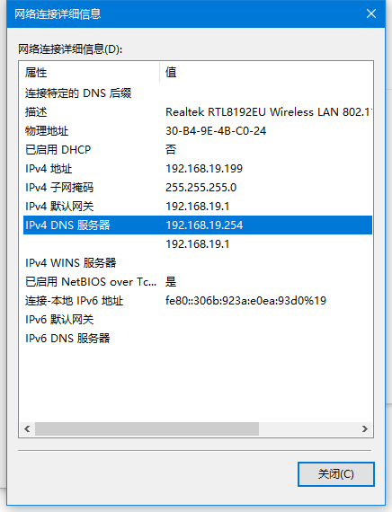
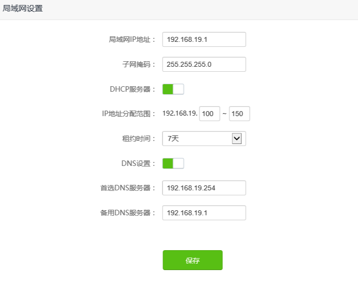

ansible-repo
========================

通用环境建立库  
本工具的目的是使用ansible尽可能快的时间建立一套测试/生产环境  
因此本工具是一套集成工具, 使用了一些约定方法, 可自行修改
快速建立起自己的一套基本的自动化环境  

###基本流程

- 1.修改配置, 全局的适应所有的安装服务
- 2.初始化运维机器
- 3.安装ansible
- 4.初始化其它所有机器(包含运维机器)
- 5.安装服务脚本, install-zone-*开头的所有服务


###注: 服务脚本有一定顺序, 主要是依赖
- install-zone-db中的kafka依赖于zookeeper中的zookeeper
- install-zone-ops中的jumpserver依赖于install-zone-db的mariadb及redis
- 先进行vars.yml配置, 以下所有代码直接复制粘贴运行即可
- 所有机器密码一致, 否则服务可能要分开执行

### 1.修改变更文件, 以适应您的环境
[详见vars.yml](vars.yml)

### 2.初始化运维机器
````
- 安装服务下载依赖, 约2分钟 
  mkdir -p /app/down/ && \
  cd /app/down/ && \
  yum install -y git
    
- 下载操作库, 约1分钟
  git clone https://github.com/cifaz/ansiblerepo.git
  
- 更新yum环境为阿里云, 会更新yum缓存, 约4分钟
  cd ansiblerepo && \
  chmod -R u+x ./*.sh && \
  ./install-centos-aliyum.sh
  
- 运维机器常用软件安装, 约4分钟
  1.初始化基本目录(/app/)   
  2.初始化常用依赖组件/工具(如ansible/jumpserver等依赖)   
  3.更换时区和设置中国时间, 更新yum缓存  
  ./install-centos-ops-init.sh

````

### 3.安装ansible 目前仅限于centos7
```
- 安装ansible, 安装完毕检查版本号, 约2分钟
  yum install -y ansible && ansible --version
   
- ansible配置基本目录
  mkdir -p /app/data/ansible/{hosts,playbooks}
   
- 加入ansible配置
  vi /etc/ansible/ansible.cfg
 
- 加下如下配置 [defaults]节点下, 复制进去即可
  inventory=/app/data/ansible/hosts/
  roles_path=/app/data/ansible/playbooks/roles:/etc/ansible/roles:/usr/share/ansible/roles
  host_key_checking = False
  callback_whitelist = profile_tasks
  
- 建立机器配置
  建议同类机器建立, 如
  web: web机器
  db: 数据库, 主数据库
  db2: 从数据库, 备份数据
  ops: 运维机器, 一般指本机, 也可以用local
  public: 公共组件机器
  各种机器类型又可以再进行细分
   
  touch /app/data/ansible/hosts/web && \ 
  touch /app/data/ansible/hosts/db && \
  touch /app/data/ansible/hosts/local && \
  touch /app/data/ansible/hosts/public 
  
  例:
  共3台机器
  192.168.19.254 / 253 / 252
  ops机, localhost不分配
  db: 253
  web: 252
  
  // web
  vi /app/data/ansible/hosts/web
  [web]
  192.168.19.252
  
  // db 
  vi /app/data/ansible/hosts/db
  [db]
  192.168.19.253
  
  // local 
  vi /app/data/ansible/hosts/local
  [db]
  192.168.19.254
  
- 环境划分建议
  运维机一台, jdk, jumpserver, dnsmasq, openvpn, jenkins, nginx, zentao, xwiki
  仓库服务, gitlab, nexus
  WEB服务二台, nodejs, jdk, tomcat, zookeeper
  数据库一台, kafka, redis, mysql, mongodb
  基础服务, 业务服务, 暂无, 和WEB服务有点像, 如CAS, dubbo监控, 部署服务等

```

### 4.初始化其它所有机器(包含运维机器)
```
  
- 安装galaxy角色, 约5分钟, 下载所有依赖项, 有些慢, 主要看网速了
   ansible-playbook install-ansible-galaxy.yml
  
- 初始化ssh-key, 不重复发放
   ansible-playbook install-init-generate-ssh-key.yml
  
- 分发到其它所有机器, 注:此步时, 需要所有机器密码一致, 约12分钟
   ansible-playbook install-init-publish-ssh-key.yml -k
  
- 运维机
  常规安装, 
  如下配置需要自己处理
  nginx, /etc/nginx/nginx.conf 及 /etc/nginx/conf.d/下的文件需要建立, 模板
  dnsmasq, /etc/dnsmasq.d/下建立自己的域名拦截解析, 模板
  
```

### 5.安装服务脚本, install-zone-*开头的所有服务
```
- 配置 var.yml 修改为自己合适的配置, 
  其它配置如路径, 规划为通用路径, 可不修改, 但请修改各应用端口号及IP
  
- 安装
  # 约8分钟
  ansible-playbook install-zone-zookeeper.yml
  # 约55分, kafka依赖zookeeper
  ansible-playbook install-zone-db.yml
  # 约40分钟, jumpserver依赖redis, mysql
  ansible-playbook install-zone-ops.yml
  # 约5分钟
  ansible-playbook install-zone-web.yml
  # 约40分钟, nexus提示密码修改失败, 可不管用默认密码admin123进入
  ansible-playbook install-zone-ware.yml
  # 安装nginx, dnamasq配置文件, 请在vars.yml中配置, 自动生成基本配置
  ansible-playbook install-zone-conf.yml
  
```

### 内网域名访问
- 本安装包 dnsmasq是域名服务器, 如果您安装了, 并在vars.yml中配置后, install-zone-conf.yml会进行配置自动安装, 意味着你可以在内网使用你想使用的是域名, 

- 局域网使用时, 需要将你使用电脑的dns(第一个)修改为Dns服务器的IP, 如我的Dns服务器为192.168.19.254,那么配置如下图:
  
 
- 如果你觉得单台机器配置麻烦, 也可以更高级的配置, 如配置在路由器中, 配置在交换机中, 相关咨询请网上自行查询, 下面附路由器配置, 然后所有通用无线连接的都可以访问域名
  
  

### 错误注意
- 遇到任何[ERROR]: failed to download the file时, 请重新执行脚本即可重新下载
  
- zookeeper启动报错, Error: Could not find or load main class org.apache.zookeeper.server.quorum.QuorumPeerMain
  是安装包下载不完整, 请更新国内地址

- zookeeper下载时, 如果某个节点报错, 请直接重新运行安装命令, 会重新下载即可,  主要原因为下载时错误


License
-------

MIT

Author Information
------------------

ccz <hanlin2531@163.com>

